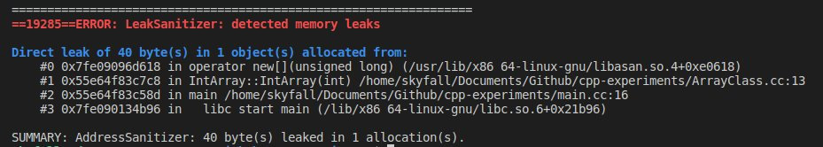

# ArrayList Class in C++

**Minimal implementation** of a bound safe array class with all the modern C++ constructs

## Motivation

This repo is the result of the following motivations:
- Revisiting C++ concepts
- Implementing modern C++ constructs

### Topic Covered

This repo covers the following topics:
- Operator Overloading
- Move Semantics
- Copy Constructors
- Custom Exceptions
- Templates
- File Organisation

### Usage and Compilation

Sample snippet from **src/main.cpp**

```cpp 
#include "../classes/ArrayList.cpp"

int main(int argc, char **argv) {
  // declaring empty int array
  ArrayList<int> a{};
  
  // declaring an int array of size 10
  ArrayList<int> b{10};
  
  // filling the values
  for (int i = 0; i < b.size(); i += 1)
  {
    b[i] = i * 10 + 1    
  }
  
  // display the list
  std::cout << b << std::endl;

  return 0;
}

```

Compilation

- Normal 

```bash
# compile
g++ -std=c++14 -Wall ./src/main.cpp -o main

#execute
./bin/main
```
- With debug mode and checking memory leaks

```bash
# compile with address sanitizer
g++ -std=c++14 -Wall -fsanitize=address -g ./src/main.cpp -o main

# execute to see memory leaks (if any)
./bin/main
```

Here is a snapshot of the memory leak detection (Remove the destructor and see the leak)



#### Notes

- More about [AddressSanitizer](https://clang.llvm.org/docs/AddressSanitizer.html) 
